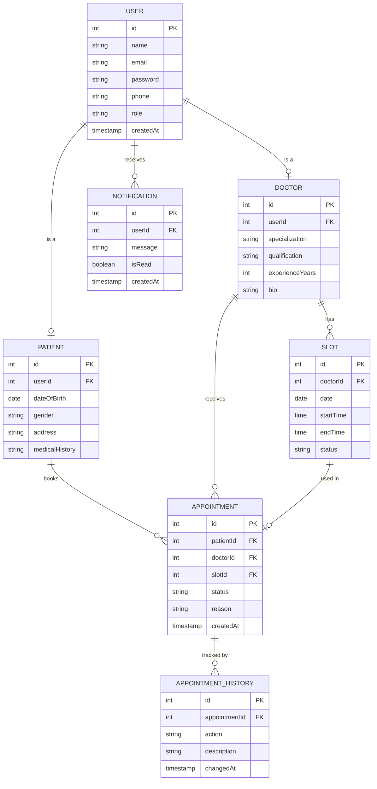

# Schedula - Doctor Appointment Scheduler

A NestJS-based backend for managing doctor-patient appointments.

## Tech Stack
- **Backend:** NestJS + TypeScript
- **Database:** PostgreSQL
- **Version Control:** Git & GitHub

## ER Diagram

